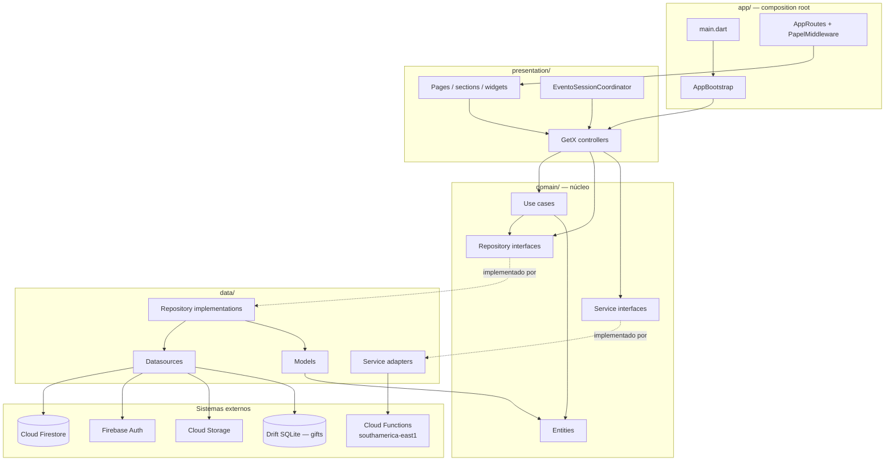
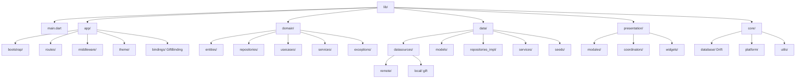
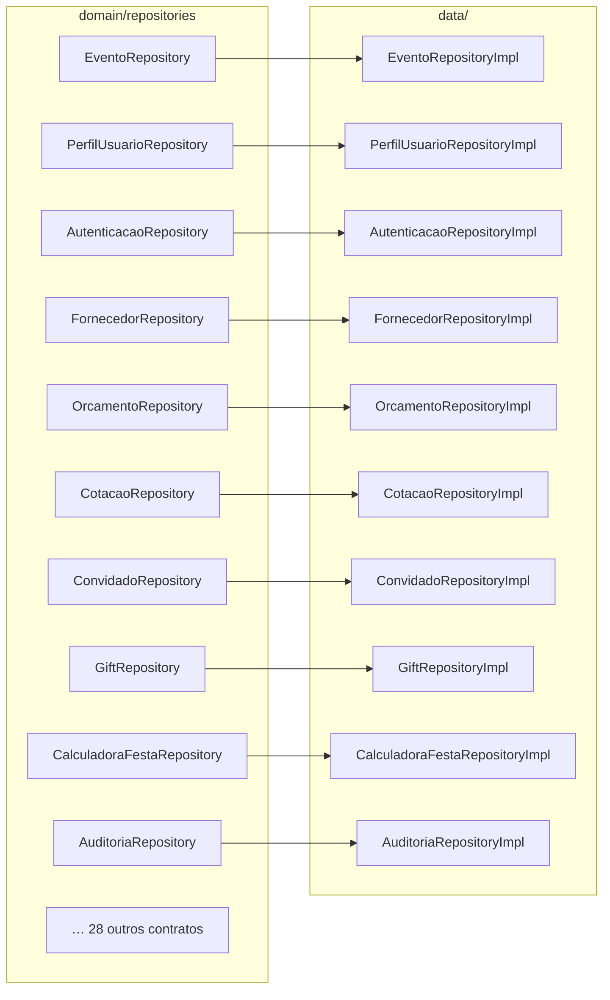
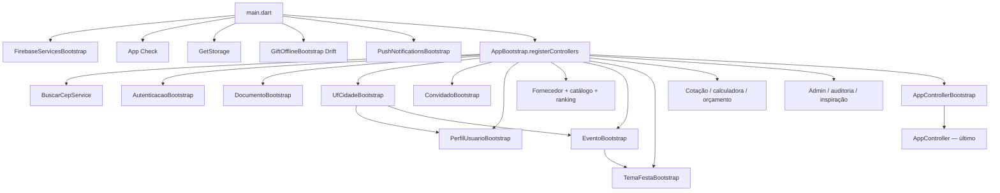
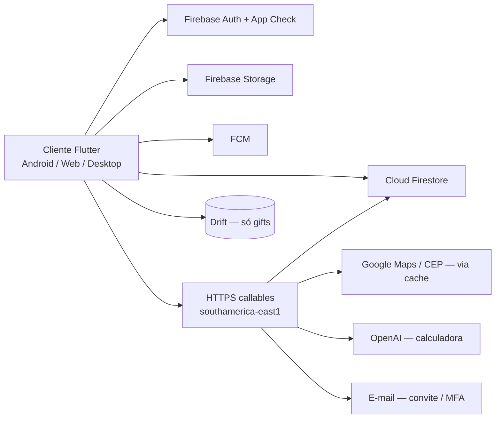
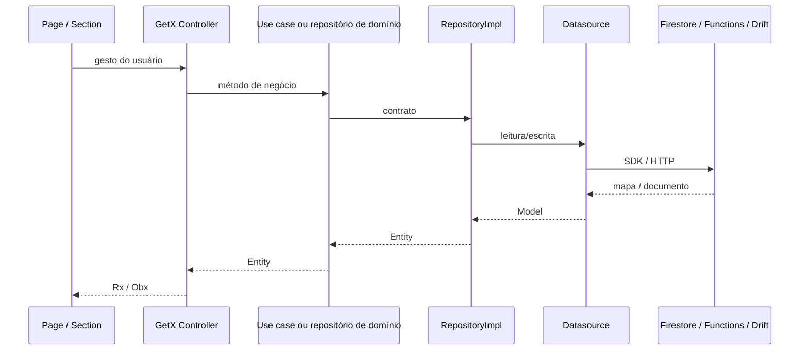
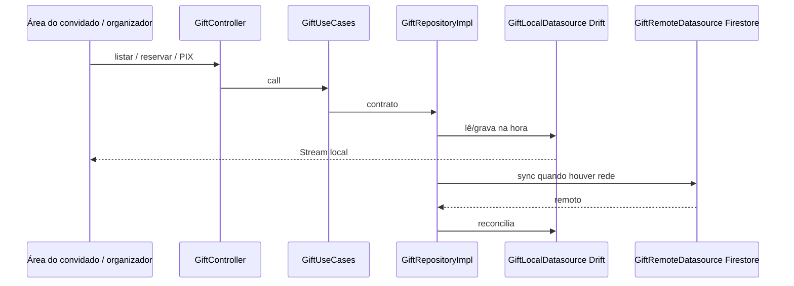

# Organogramas

Diagramas da estrutura **atual**. Renderizam em GitHub, VS Code (Mermaid) e editores com suporte a GFM.

## 1. Camadas (visão em cebola)

## 2. Organograma de pastas (`lib/`)

## 3. Organograma de módulos de UI por papel

Papel vem de `Usuario.tipo` e é aplicado em `PapelMiddleware` + `AppCicloSessao`.

```mermaid
flowchart TB
  APP[AppController / ciclo de sessão]
  APP --> ORG["Organizador — tipo padrão"]
  APP --> FORN["Fornecedor — F"]
  APP --> CONV["Convidado — C"]
  APP --> ADM["Administrador — A"]

  ORG --> EV[eventos]
  ORG --> CALC[calculadora]
  ORG --> ORC[orcamento]
  ORG --> COT[cotacao]
  ORG --> CHK[checklist]
  ORG --> INS[inspiracao]
  ORG --> CAT_O[catalogo / fornecedor]
  ORG --> CONV_M[convidado — lista e convites]
  ORG --> GIFT[gifts]
  ORG --> TEMA[tema]

  FORN --> FORN_M[fornecedor — painel]
  FORN --> COT_F[cotacao]
  FORN --> ORC_F[orcamento]

  CONV --> AREA[convidado — área do convidado]
  CONV --> GIFT_C[gifts — reserva / PIX]
  CONV --> CHK_C[checklist — tarefas do convidado]

  ADM --> DASH[admin]
  ADM --> AUD[auditoria]
  ADM --> CAT_A[catalogo]
  ADM --> TERR[admin território]
  ADM --> USR[usuario]
  ADM --> RANK[ranking]
```

## 4. Organograma domínio ↔ dados (contratos)

Cada caixa da esquerda é um `abstract interface class` em `domain/repositories`. A da direita é a impl em `data/repositories_impl` + datasource.

Há **38** pares contrato/implementação. A lista completa está em [03 — Módulos](03-modulos-bootstrap-e-fluxos.md).

## 5. Organograma da raiz de composição

Ordem real de `AppBootstrap.registerControllers()` (dependências eager primeiro).

`UFCidadeController` é registrado **antes** do perfil e do cadastro de evento porque esses controllers fazem `Get.put` imediato com `Get.find<UFCidadeController>()`.

## 6. Sistemas ao redor do app

## 7. Fluxo de uma ação na UI

## 8. Gifts (único fluxo offline-first completo)

